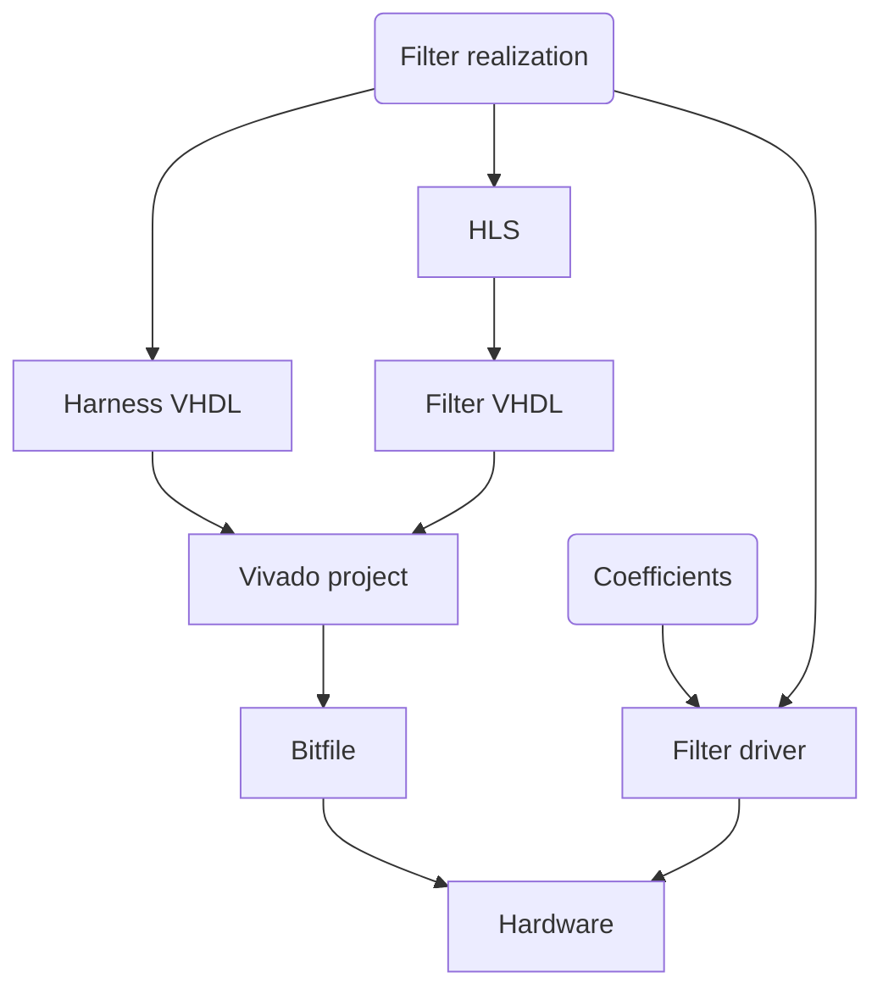
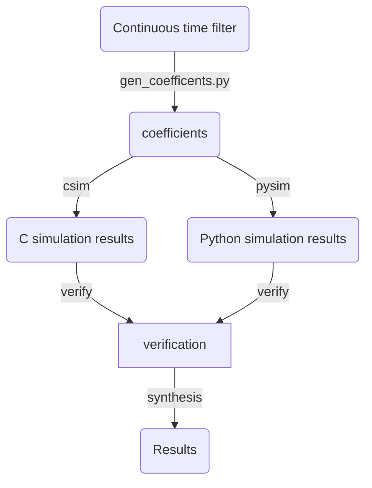

Welcome to the GQuEST firmware repository! Here you will find code related to feedback control and data acquisition for the GQuEST interferometer, in particular related to the LLCOOLJ FPGA system.

